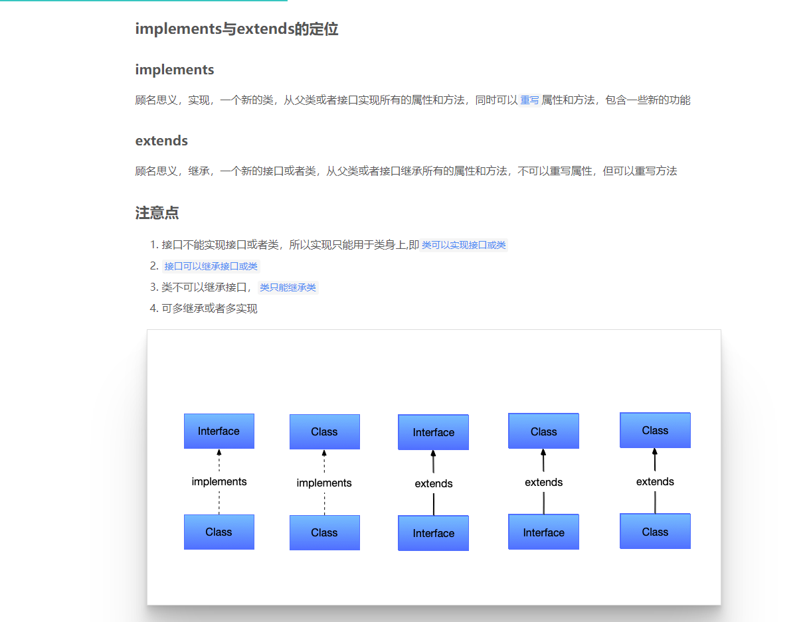

### 一、TypeScript简介与环境配置

### 二、QA

### 1、type、class、interface关键字在定义对象类型时的差异性 ？

    - class: 由于ts的宗旨是兼容js，运行时需要擦除所有的类型信息，
             经过编译之后，在运行时，type / interface 会被完全消除，
             而class经过编译之后在运行时依然存在。因此，如果要声明的类型只是纯粹的
             类型信息，只需要声明interface即可。
    - type: 更倾向于组合
    - interface: 更倾向于继承  
                在面向对象的语言中，术语interface经常被用来定义一个不包含数据和逻辑代码但是用来签名定义了行为的抽象类型。

[class 和 interface讲解](https://www.cnblogs.com/hlandzpy/p/13213656.html)

[单例模式讲解](https://www.jianshu.com/p/6571e0c78e0d)

### 2、元组和数组的区别 ？

    - 元祖可以存储不同类型元素集合
    - 数组一般用于保存相同类型元素集合
    
### 3、接口和类的约束: implements、接口间的继承: extends

### 4、为什么 类不能继承接口，类只能实现接口？
